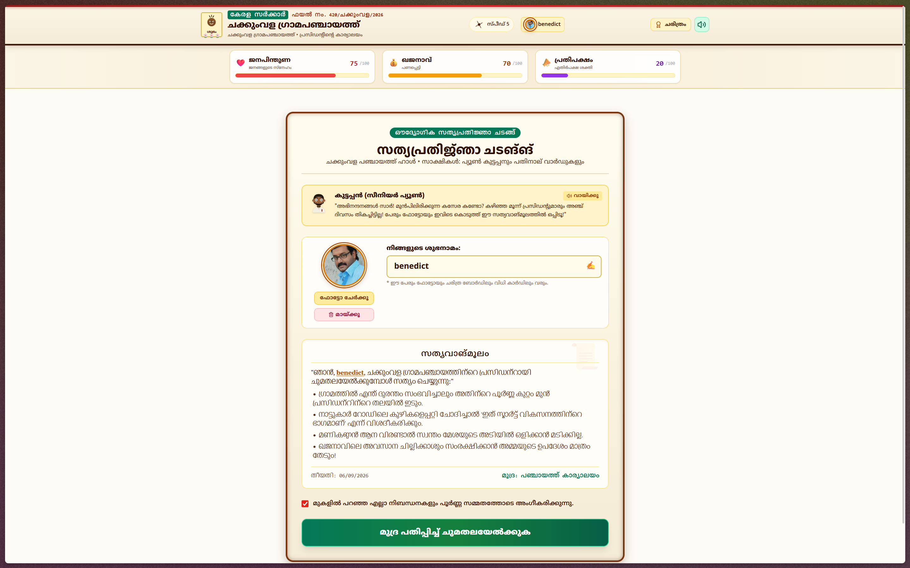
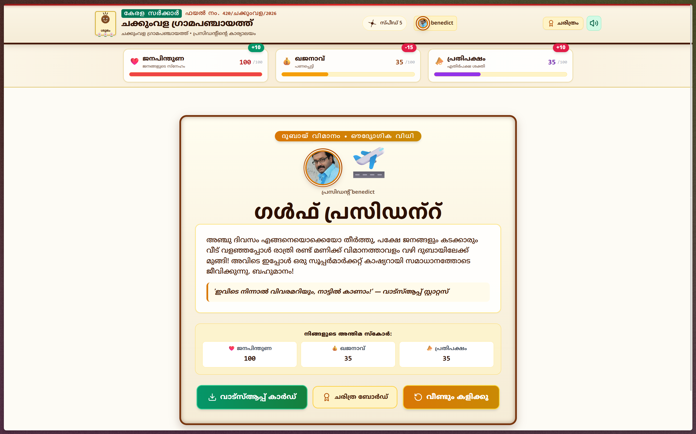
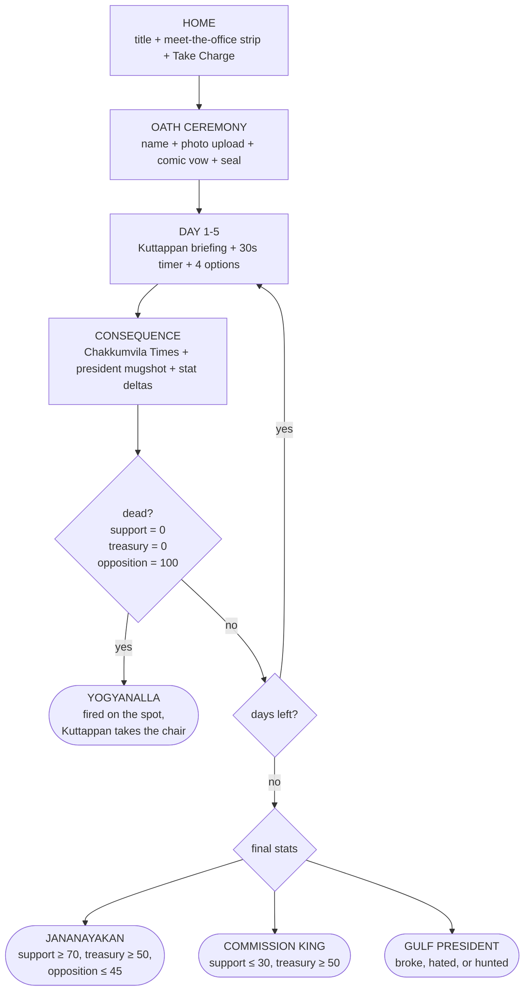
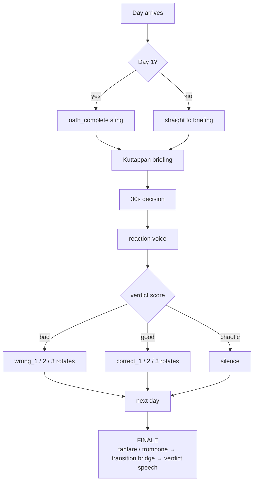

# പഞ്ചായത്ത് പ്രസിഡന്റ് SIMULATOR 
### Panchayat President Simulator — Chakkumvila Grama Panchayat

## Basic Details
### Team Name: Zero Blunders

### Team Members
- Team Lead: Benedict Chacko Mathew - Viswajyothi College of Engineering and Technology, Vazhakulam
- Member 2: Dipin Sunny - Viswajyothi College of Engineering and Technology, Vazhakulam

### Project Description
You are the newly elected President of Chakkumvila Panchayat. Survive 5 days of absurd village crises — water mafia, street-dog unions, exam-eve blackouts, a double-booked wedding hall and a surprise collector inspection. Every decision is timed (30 seconds), fully voiced in Malayalam, and every mistake lands your photo in the newspaper under "പ്രതി" (Accused).

### The Problem (that doesn't exist)
Nobody asked who should run a fictional Kerala village through five consecutive disasters while a clerk narrates your downfall and the opposition counts your mistakes. The chair was empty. The coconut demanded a president.

### The Solution (that nobody asked for)
A fully Malayalam, choice-driven village-government simulator with dramatic voice acting, a live opposition meter that can topple you with a no-confidence motion, five movie-soaked crises (Lucifer! Drishyam! Kilukkam! Sandesham!), hand-drawn SVG characters, and four possible fates — hero, commission king, Gulf escapee, or fired on the spot.

## Technical Details
### Technologies/Components Used
For Software:
- Languages: JavaScript (ES6+), Malayalam-first UI copy
- Frameworks: React 18, Vite 6
- Libraries: Tailwind CSS, Framer-style CSS animations, canvas-confetti, lucide-react
- Tools: Web Audio API (synth conch/chenda/jingle/trombone), SpeechSynthesis Malayalam TTS fallback, HTML5 Canvas (WhatsApp share card), localStorage (photo + presidents wall)

### Implementation
For Software:
# Installation
```bash
git clone https://github.com/The-Peacemaker/Panchayath-Simulation.git
cd Panchayath-Simulation
npm install
```

# Run
```bash
npm run dev
# open http://localhost:3000
```

# Build
```bash
npm run build
npm run preview
```

### Project Documentation
For Software:

# Screenshots

*Oath ceremony — president name entry, photo upload with gold kasavu frame, Kuttappan's warning, and the solemn vow document before taking charge*


*Day 1 gameplay — live stat meters, Kuttappan's dramatic water-crisis briefing with whisper tip, sleeping Manikandan buddy row, 30-second timer, and four movie-soaked options (Lucifer! Drishyam!)*


*Ending screen — president photo beside the verdict icon, full Malayalam ending story, final stat table with live deltas, WhatsApp share-card download, history board and replay buttons*

# Diagrams

## Game loop — how a presidency lives and dies



*Five days, one timer each. Survive all five without collapsing a meter and the finale sorts you into hero, villain, fugitive — or the chair goes to Kuttappan mid-game.*

## Audio chain — every screen talks



*Recorded Malayalam clips chained with zero overlap; missing clips fall back to Malayalam TTS automatically, and fast click-throughs can never leak audio onto the next screen.*

### Project Demo
**Live deployment:** https://panchayath-president.netlify.app/
*Play the full game in your browser — no install needed. For the complete experience, allow sound and upload a president photo at the oath ceremony.*

## Team Contributions
- Benedict Chacko Mathew: Game architecture, state engine and balance design, audio/voice system and chaining, UI theme, SVG character sprites, deployment and documentation.
- Dipin Sunny: Story scenarios and Malayalam comedy writing, voice direction inputs, playtesting and bug reports.

---
Made with ❤️ at TinkerHub Useless Projects


