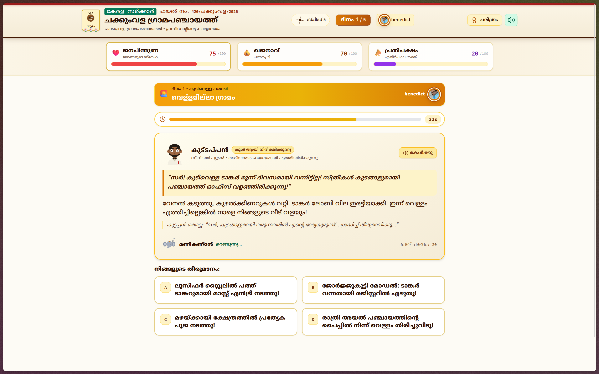

# പഞ്ചായത്ത് പ്രസിഡന്റ് SIMULATOR 🎯
### Panchayat President Simulator — Chakkumvila Grama Panchayat

## Basic Details
### Team Name: Zero Blunders

### Team Members
- Team Lead: Benedict Chacko Mathew - Viswajyothi College of Engineering and Technology, Vazhakulam
- Member 2: Dipin Sunny - Viswajyothi College of Engineering and Technology, Vazhakulam

### Project Description
You are the newly elected President of Chakkumvila Panchayat. Survive 5 days of absurd village crises — water mafia, street-dog unions, exam-eve blackouts, a double-booked wedding hall and a surprise collector inspection. Every decision is timed (30 seconds), fully voiced in Malayalam, and every mistake lands your photo in the newspaper under "പ്രതി" (Accused).

### The Problem (that doesn't exist)
Nobody asked who should run a fictional Kerala village through five consecutive disasters while a clerk narrates your downfall and the opposition counts your mistakes. The chair was empty. The coconut demanded a president.

### The Solution (that nobody asked for)
A fully Malayalam, choice-driven village-government simulator with dramatic voice acting, a live opposition meter that can topple you with a no-confidence motion, five movie-soaked crises (Lucifer! Drishyam! Kilukkam! Sandesham!), hand-drawn SVG characters, and four possible fates — hero, commission king, Gulf escapee, or fired on the spot.

## Technical Details
### Technologies/Components Used
For Software:
- Languages: JavaScript (ES6+), Malayalam-first UI copy
- Frameworks: React 18, Vite 6
- Libraries: Tailwind CSS, Framer-style CSS animations, canvas-confetti, lucide-react
- Tools: Web Audio API (synth conch/chenda/jingle/trombone), SpeechSynthesis Malayalam TTS fallback, HTML5 Canvas (WhatsApp share card), localStorage (photo + presidents wall)

### Implementation
For Software:
# Installation
```bash
git clone https://github.com/The-Peacemaker/Panchayath-Simulation.git
cd Panchayath-Simulation
npm install
```

# Run
```bash
npm run dev
# open http://localhost:3000
```

# Build
```bash
npm run build
npm run preview
```

### Project Documentation
For Software:

# Screenshots (Add at least 3)

*Home screen — title, meet-the-office strip and Take Charge button*


*Day screen — Kuttappan briefing, 30-second timer, four dilemma options*


*Chakkumvila Times consequence report with president mugshot and stat swings*

# Diagrams

*Game loop: HOME → OATH → DAY (×5, 30s timer each) → CONSEQUENCE → ENDING. Voice chain: intro sting → briefing → reaction → verdict sting. Death check on every choice (support/treasury hit 0, or opposition hits 100).*

### Project Demo
# Video
[Demo video link — to be added]
*Full playthrough: oath ceremony, one crisis day with live timer, consequence newspaper, and ending reveal with share card.*

# Additional Demos
[Live deployment link — to be added]

## Team Contributions
- Benedict Chacko Mathew: Game architecture, state engine and balance design, audio/voice system and chaining, UI theme, SVG character sprites, deployment and documentation.
- Dipin Sunny: Story scenarios and Malayalam comedy writing, voice direction inputs, playtesting and bug reports.

---
Made with ❤️ at TinkerHub Useless Projects


